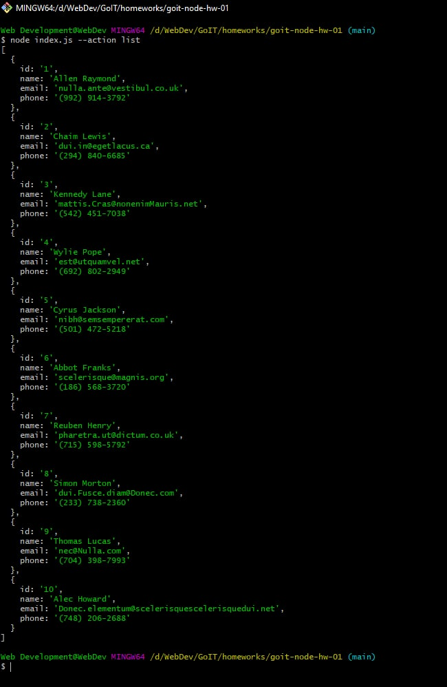
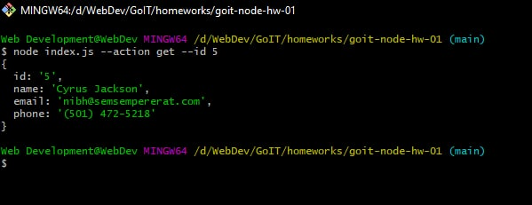
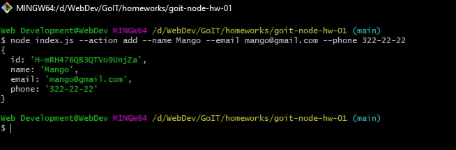
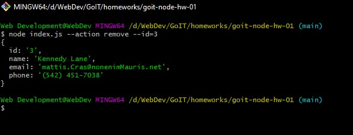

# Command screenshots
## Read all contacts
```shell
node index.js --action list
```
 
 
 ## Get on contact
```shell
node index.js --action get --id 5
```
 
 
  ## Add new contact
```shell
node index.js --action add --name Mango --email mango@gmail.com --phone 322-22-22
```
 
 
   ## Remove contact
```shell
node index.js --action remove --id=3
```
 
